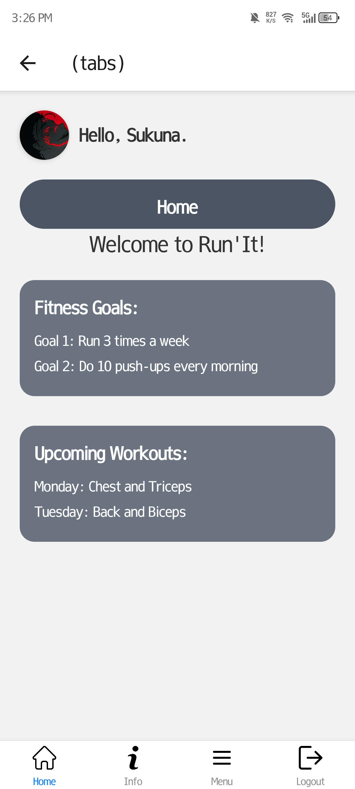
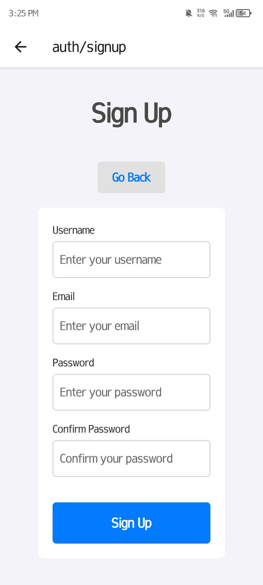
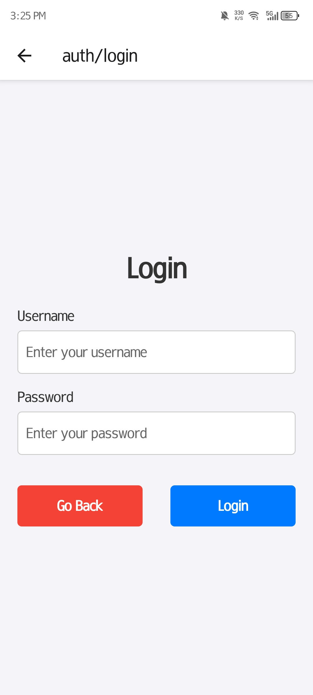
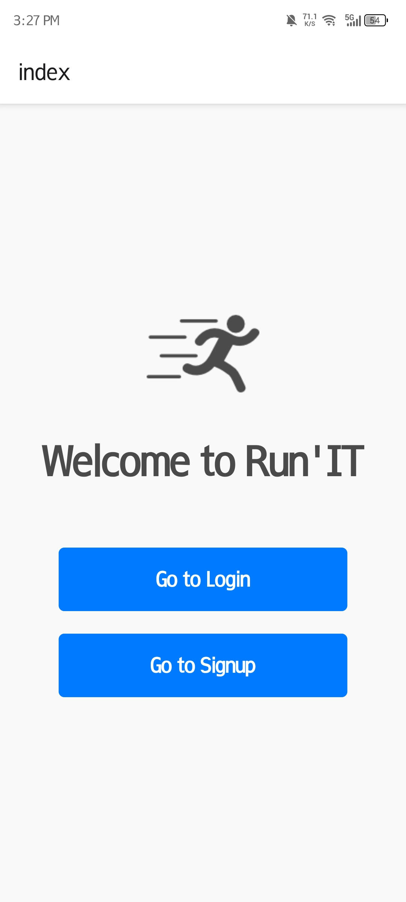

# Run'IT
The Run'IT app

# Features
* Workouts
* Fitness
* Step Tracker
* Workout Schedule

# Overview
* Basic React Native Components
* Database Design using Appwrite
* User Registration & Authenticaiton
* Deployment

# Tech Stack
* React Native
* AppWrite
* HTML, CSS and JS

# Home Screen
  

# Sign Up Screen
  

# Sign In Screen
  

# Tabs Screen
  
